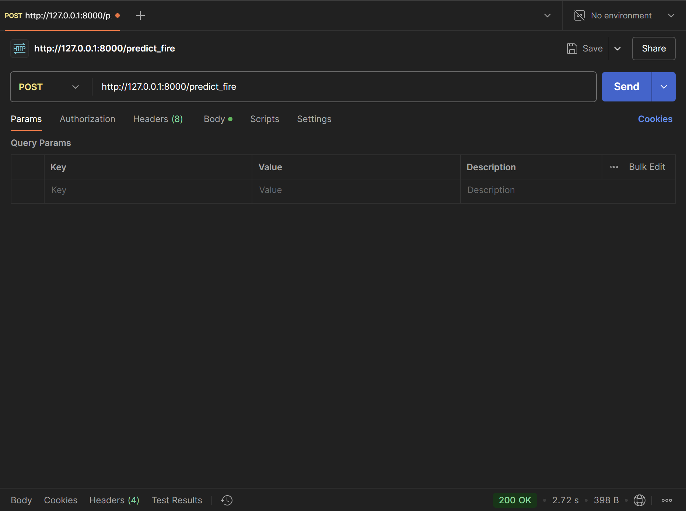
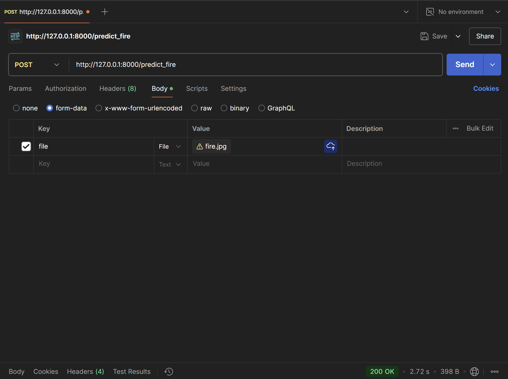
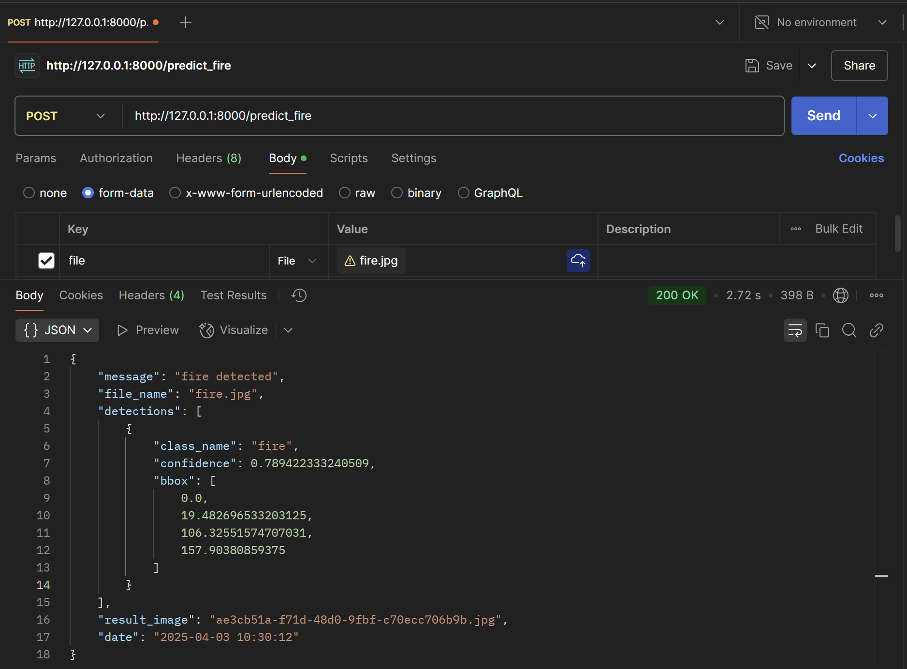
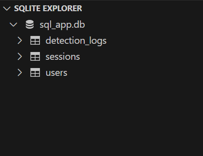
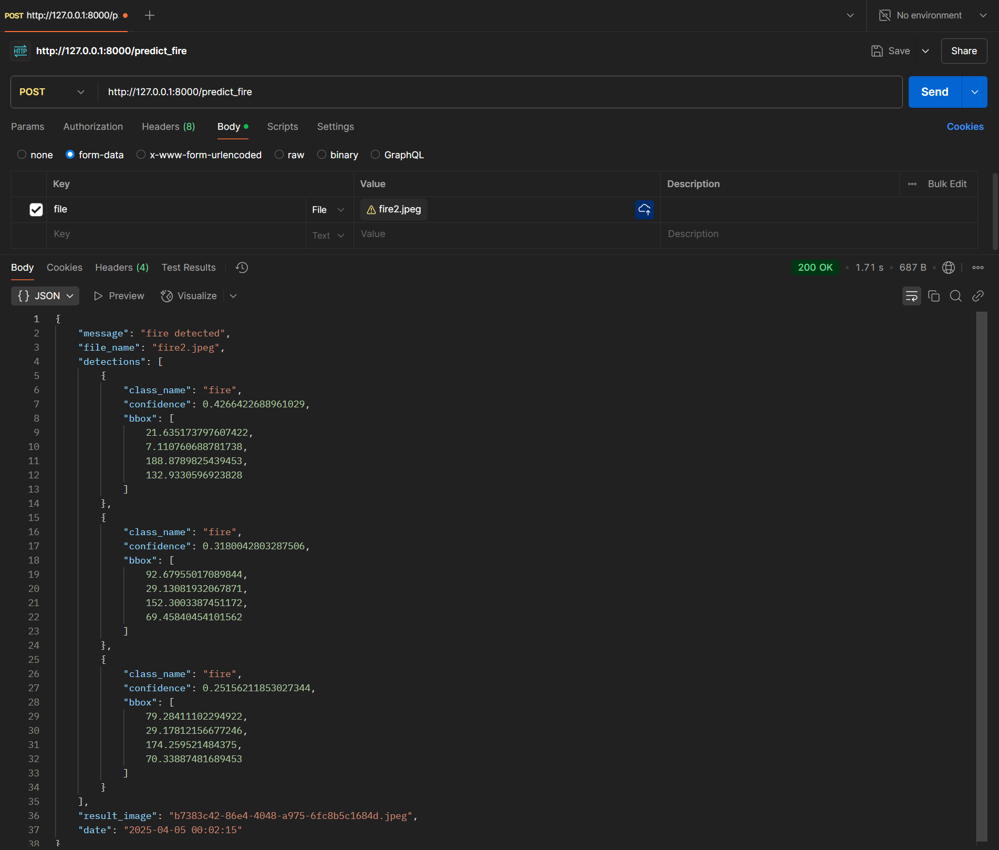
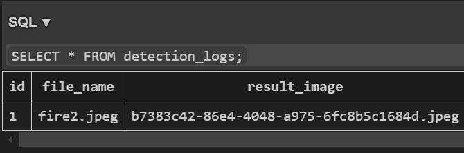
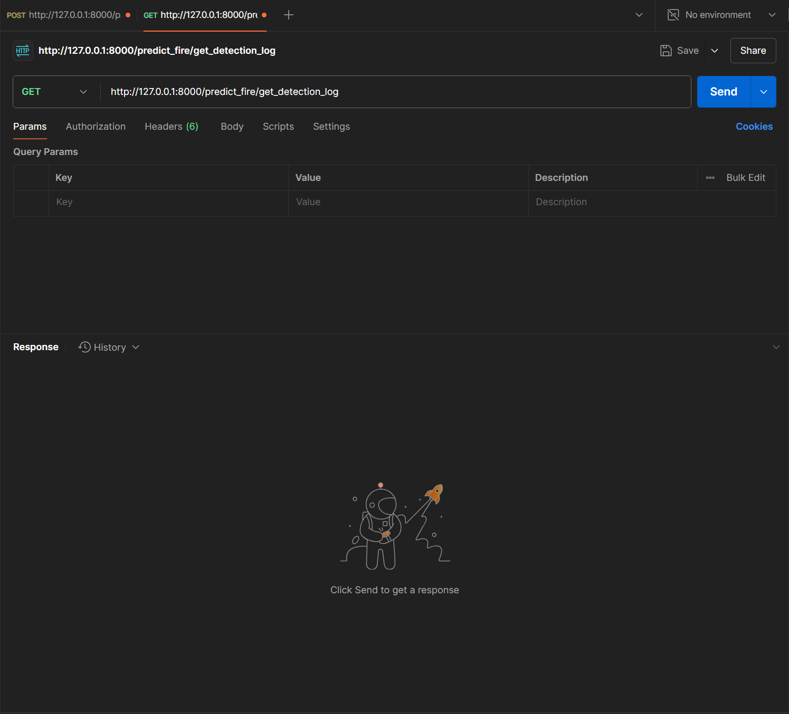
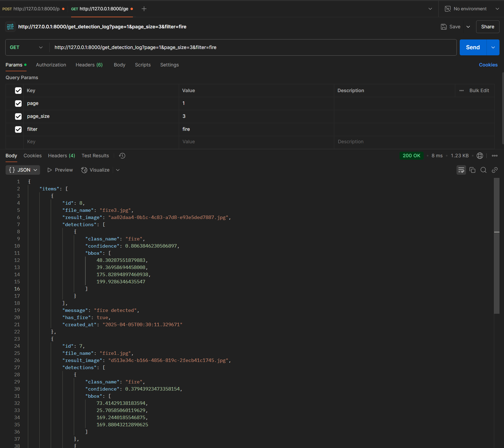

# ✅ 4, 5주차: 백엔드 개발

## FastAPI에서 Next.js 스타일의 엔드포인트 중심 구조 만들기

> 🔗 참고 자료  
- [argon2](https://argon2-cffi.readthedocs.io/en/stable/installation.html)

> argon2 가상환경에 설치

비밀번호 해싱을 위하여 `argon2` 사용

```bash
python -Im pip install argon2-cffi
```

> 간단한 API 만들기

- router: 엔드포인트 처리를 담당 (router.py: 필수적 파일)

- schema: 데이터 유효성 검사와 API의 입출력 모델 정의 관리 (schema.py: 필요시 사용)

- crud: 데이터베이스 작업 처리 (crud.py: 필요시 사용)

## YOLO 모델을 활용한 화재 감지 API 구현

> 🔗 참고 자료  
- [Postman](https://www.postman.com/)

> 파일 생성

`router.py`

```bash
# 필요한 모듈 임포트
import uuid # 고유 식별자 생성
from fastapi import APIRouter, HTTPException, File, UploadFile, Depends # API 라우팅과 예외 처리를 위한 FastAPI 모듈
from app.api.predict_fire.schema import Detection, PredictFireSchema
from sqlalchemy.orm import Session
from app.db.database import get_db
from datetime import datetime
from ultralytics import YOLO # YOLO 모델 실행
import logging # 로그 기록
import shutil
import os
import pytz  # 시간대 처리
import time
import cv2 # 이미지 처리

from app.api.predict_fire.crud import create_detection_log

router = APIRouter()

logging.basicConfig(level=logging.INFO)
logger = logging.getLogger(__name__)
# 이미지 확장자 정의
ALLOWED_EXTENSIONS = {"jpg", "jpeg", "png"}

# 업로드된 파일의 이름을 확인해 이 집합에 포함되는지 검사
def allowed_file(filename: str) -> bool:
    """
    confirm file extension is in ALLOWED_EXTENSIONS
    """
    return "." in filename and filename.rsplit(".", 1)[1].lower() in ALLOWED_EXTENSIONS

# 기존 파일의 확장자 유지, 고유한 랜덤 파일 이름 생성
def generate_random_file_name(filename: str) -> str:
    """
    keep file extension and generate random file name
    """
    _, file_extension = os.path.splitext(filename)
    random_file_name = f"{uuid.uuid4()}{file_extension}"
    return random_file_name

@router.post("/predict_fire", response_model=PredictFireSchema)
async def predict_fire(
    file: UploadFile = File(...),
    db: Session = Depends(get_db),
    # current_user=Depends(get_current_user),
):
    logger.info("--------------------------------")
    logger.info("Received file: {file.filename}")

    # 파일 확장자 검사
    if not allowed_file(file.filename):
        raise HTTPException(
            status_code=422,
            detail="unsupported file format. only jpg, jpeg or png are allowed.",
        )

    # 생성된 파일 이름을 사용해 temp라는 디렉토리에 업로드된 파일 저장
    new_file_name = generate_random_file_name(file.filename)
    temp_dir = "temp"
    os.makedirs(temp_dir, exist_ok=True)
    temp_file_path = os.path.join(temp_dir, new_file_name)

    try:
        with open(temp_file_path, "wb") as buffer:
            shutil.copyfileobj(file.file, buffer)
    except IOError as e:
        logger.error(f"error occurred while saving file: {str(e)}")
        raise HTTPException(status_code=500, detail="failed to save file.")

    # 학습된 모델 불러오기
    try:
        model = YOLO("assets/best.pt")
        logger.info("model loaded successfully.")
    except Exception as e:
        logger.error(f"error occurred while loading model: {str(e)}")
        raise HTTPException(status_code=500, detail="failed to load model.")

    try:
        results = model(temp_file_path)

        result = results[0]
        boxes = result.boxes

        annotated_img = result.plot()  # or result.render()

        processed_result = {"file_name": file.filename, "detections": []}
        fire_detected = False

        # 예측 결과 순회, 객체 정보 추출해서 Detection 객체로 생성
        for box in boxes:
            class_name = model.names[int(box.cls)]
            detection = Detection(
                class_name=class_name,
                confidence=float(box.conf),
                bbox=box.xyxy[0].tolist(),
            )
            processed_result["detections"].append(detection)

            if class_name == "fire":
                fire_detected = True

        # 현재 시간 UTC -> Asia/Seoul 시간대로 변환하여 기록
        utc_now = datetime.now(pytz.UTC)
        korea_timezone = pytz.timezone("Asia/Seoul")
        current_time = utc_now.astimezone(korea_timezone).strftime("%Y-%m-%d %H:%M:%S")

        log_dir = "log"
        os.makedirs(log_dir, exist_ok=True)

        if fire_detected:
            log_file_path = os.path.join(log_dir, new_file_name)
            cv2.imwrite(log_file_path, annotated_img)

            result_file_key = new_file_name 

            resResult = {
                "message": "fire detected",
                "file_name": file.filename,
                "detections": processed_result["detections"],
                "result_image": result_file_key,  # S3 파일 키로 변경
                "date": current_time,
            }
            # delete result image (later)
            # if os.path.exists(log_file_path):
            #     try:
            #         os.remove(log_file_path)
            #         logger.info(f"Successfully deleted result file: {log_file_path}")
            #     except Exception as e:
            #         logger.error(f"Failed to delete result file: {str(e)}")
        else:
            resResult = {
                "message": "safe",
                "file_name": None,
                "detections": processed_result["detections"],
                "result_image": None,
                "date": current_time,
            }

        create_detection_log(db=db, detection_data=resResult)

        logger.info(f"Response result: {resResult}")
        return resResult

    except Exception as e:
        logger.error(f"error occurred while processing image: {str(e)}")
        raise HTTPException(status_code=500, detail="failed to process image.")

    finally:
        logger.info("Cleaning up temporary files.")
        # delete temp file (later)
        # if os.path.exists(temp_file_path):
        #     try:
        #         os.remove(temp_file_path)
        #         logger.info(f"Successfully deleted temp file: {temp_file_path}")
        #     except Exception as e:
        #         logger.error(f"Failed to delete temp file: {str(e)}")
```

`schema.py` (응답 데이터의 타입 정의 역할)

```bash
from pydantic import BaseModel
from typing import List, Dict, Any, Union

# 이미지 처리 결과의 단일 탐지 정보 모델
class Detection(BaseModel):
    class_name: str
    confidence: float
    bbox: List[float]

class PredictFireSchema(BaseModel):
    message: str
    file_name: Union[str, None]
    detections: List[Detection]
    result_image: Union[str, None]
    date: str
```

> Postman을 이용하여 API 테스트



```
요청 URL에 서버 주소와 /predict_fire 엔드포인트 입력
```



```
Body 탭에서 form-data를 선택하고, 키 값으로 file을 추가한 후 파일 타입을 File로 설정
```



```
테스트할 이미지 파일을 선택한 후 Send 버튼을 누르면 서버로 파일이 전송되어 처리 결과가 JSON 형식으로 응답

응답 메시지에서는 화재가 감지되면 message가 fire detected, 그렇지 않으면 safe로 표시되며, 파일 이름, 탐지 결과, 결과 이미지 파일 키 그리고 날짜 정보가 포함 
```

## FastAPI를 활용한 정적 파일 서빙

> `main.py` 코드

```bash
from typing import Union
from fastapi import FastAPI
from fastapi.middleware.cors import CORSMiddleware
from pathlib import Path
import importlib
import pkgutil

import sys
import os # os 모듈 사용하여 파일 경로 설정

sys.path.append(os.path.dirname(os.path.dirname(os.path.abspath(__file__))))
from app.api.create_user.router import router as create_user_router
from app.api.get_test.router import router as get_test_router

from app.db.database import engine, Base
from app.db.models import (
    user as user_model,
    session as session_model,
    detection_log as detection_log_model,
)

# FastAPI에서 정적 파일 서빙 모듈
from fastapi.staticfiles import StaticFiles

def init_db():
    Base.metadata.create_all(bind=engine)

from contextlib import asynccontextmanager

@asynccontextmanager
async def lifespan(app: FastAPI):
    init_db()
    yield

app = FastAPI(lifespan=lifespan)

app.add_middleware(
    CORSMiddleware,
    allow_origins=["*"],
    allow_credentials=True,
    allow_methods=["*"],
    allow_headers=["*"],
)

api_dir = Path(__file__).parent / "api"

for api in api_dir.iterdir():
    if api.is_dir(): 
        router_module = f"app.api.{api.name}.router"
        try:
            module = importlib.import_module(router_module)
            if hasattr(module, "router"):
                app.include_router(module.router)
                print(f"✅ router added: {router_module}")  # debug
        except ModuleNotFoundError:
            if api.name == "__pycache__" or api.name == "__init__":
                continue
            print(f"⚠️ {router_module} not found (router.py is missing)")

log_directory = os.path.join(os.path.dirname(__file__), "log")

# log 폴더가 없으면 생성
if not os.path.exists(log_directory):
    os.makedirs(log_directory)

app.mount("/log", StaticFiles(directory=log_directory), name="log")
```

> FastAPI 서버 실행 시 log 폴더에 있는 이미지 파일 외부에서 접근

```bash
http://localhost:8000/log/filename
```

```
일반적으로 AWS와 같은 클라우드 서비스를 사용하여 이미지를 서방할 때는 보안 설정을 통해 접근을 제한한다.

예를 들어, 특정 IP 주소나 도메인에서만 접근할 수 있도록 설정하거나, 인증된 사용자만 파일에 접근할 수 있도록 제한한다.

이러한 보안 설정은 데이터의 무단 접근을 방지하고, 서비스의 안정성을 높이는 데 필수적이다.
```

## 화재 감지 로그 저장 및 개선된 DB 구조 반영하기

> 🔗 참고 자료 
- [SQLAlchemy](https://docs.sqlalchemy.org/en/20/orm/session_api.html)

> 화재 감지 데이터 DB에 로깅

`crud.py` 파일 추가

```bash
from sqlalchemy.orm import Session
from app.db.models.detection_log import DetectionLog

def create_detection_log(db: Session, detection_data: dict):
    detections_list = [
        {"class_name": d.class_name, "confidence": d.confidence, "bbox": d.bbox}
        for d in detection_data["detections"]
    ]
    db_log = DetectionLog(
        file_name=detection_data["file_name"],
        result_image=detection_data["result_image"],
        detections=detections_list,
        message=detection_data["message"],
        has_fire=any(d.class_name == "fire" for d in detection_data["detections"]),
    )
    db.add(db_log)
    db.commit()
    db.refresh(db_log)
    return db_log

```

```
감지된 데이터를 가공한 후, 데이터베이스에 저장한다.

add()는 객체를 세션에 추가, 실제 반영은 'commit()' 이후에 이루어진다.

commit()은 변경 사항을 데이터베이스에 저장한다.

refresh()는 데이터베이스에서 최신 데이터를 다시 불러와 객체를 업데이트 한다.
```

> DB 구조 개선 후 화재 감지 데이터 기록




```
DB 구조 개선 후 Postman으로 'predict_fire' 엔드포이트에 요청을 보내서 화재 감지 데이터 기록
```



```
detection_logs를 보면 데이터가 기록된 것을 확인할 수 있다.
```

## 화재 감지 로그 조회 API 구현

> 화재 감지 로그를 페이지네이션 처리하여 조회하는 API를 구현

```
`router.py`는 서비스 로직을 조립하여, 'crud'와 'schema'의 내용을 순서대로 호출한다.

`crud.py`'는 데이터베이스에서 테이블의 데이터를 검색하기 위한 쿼리 객체를 생성하고, 원하는 데이터를 효율적으로 가져올 수 있도록 준비하는 과정이다.

`schema.py`는 API의 반환 타입을 정의한다.

추가적으로 모델을 공통적으로 사용해야 하므로 `share_schema` 파일에 정의한다.

```

> Postman으로 API 테스트


```
화재 감지 API를 실행하여 미리 데이터 추가
```



```
Postman에서 요청 URL에 서버 주소와 /get_detection_log 엔드포인트 입력
```



```
Params 탭에서 키 값으로 'page', 'page_size', 'filter을 추가한 후 값을 조정하여 페이지네이션 동작 확인
```
